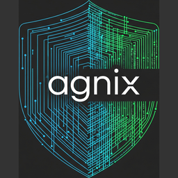
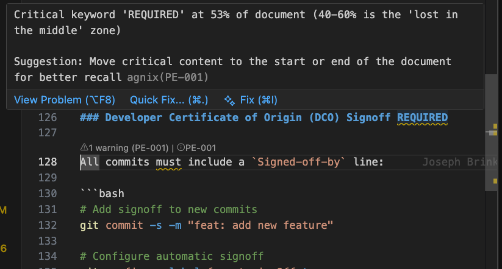

<div align="center">
  
  <h1>agnix</h1>
  <p><strong>Lint agent configurations before they break your workflow</strong></p>
  <p>
    <a href="https://www.npmjs.com/package/agnix"></a>
    <a href="https://crates.io/crates/agnix-cli"></a>
    <a href="https://github.com/avifenesh/agnix/releases"></a>
    <a href="https://github.com/avifenesh/agnix/actions/workflows/ci.yml"></a>
    <a href="https://codecov.io/gh/avifenesh/agnix"></a>
    <a href="LICENSE-MIT"></a>
  </p>
</div>

The linter for your AI coding stack -- skills, hooks, memory, plugins, MCP, and agent configs. CLI, LSP server, and IDE plugins for Claude Code, Cursor, GitHub Copilot, Codex CLI, and more.

**100 validation rules** | **Auto-fix** | **VS Code + JetBrains + Neovim** | **GitHub Action**

## Quick Start

```console
$ npx agnix .
Validating: .

CLAUDE.md:15:1 warning: Generic instruction 'Be helpful and accurate' [fixable]
  help: Remove generic instructions. Claude already knows this.

.claude/skills/review/SKILL.md:3:1 error: Invalid name 'Review-Code' [fixable]
  help: Use lowercase letters and hyphens only (e.g., 'code-review')

Found 1 error, 1 warning
  2 issues are automatically fixable

hint: Run with --fix to apply fixes
```

<p align="center">
  
  
</p>

<p align="center">
  Like what you see?
  <a href="https://github.com/avifenesh/agnix/stargazers">Give it a star</a>
  -- it helps other developers find agnix.
</p>

## Why agnix?

The AI coding landscape is chaos. Every tool wants your config in a different format:

| Tool | Config Files | Format |
|------|-------------|--------|
| Claude Code | `CLAUDE.md`, `.claude/settings.json` | Markdown + JSON |
| Skills | `.claude/skills/*/SKILL.md` | Markdown with frontmatter |
| Hooks | `.claude/settings.json` hooks | JSON |
| Agents | `.claude/agents/*.md` | Markdown |
| Plugins | `.claude/plugins/` | JSON |
| Cursor | `.cursor/rules/*.mdc`, `.cursorrules` | MDC |
| GitHub Copilot | `.github/copilot-instructions.md` | Markdown |
| Codex CLI / AGENTS.md | `AGENTS.md`, `AGENTS.local.md` | Markdown |
| MCP | `*.mcp.json` | JSON Schema |

**The problems are real:**

- **Skills don't auto-trigger** - Vercel's research found [skills invoke at 0%](https://vercel.com/blog/agents-md-outperforms-skills-in-our-agent-evals) without explicit prompting. Wrong syntax means your skill never runs.
- **Almost-right is worse than wrong** - [66% of developers](https://survey.stackoverflow.co/2025/ai) cite "AI solutions that are almost right" as their biggest frustration. Broken configs cause exactly this.
- **Unbundled stack, fragmented configs** - Developers mix Cursor + Claude Code + Copilot. A config that works in one tool [silently fails in another](https://arnav.tech/beyond-copilot-cursor-and-claude-code-the-unbundled-coding-ai-tools-stack).
- **Inconsistent patterns become chaos amplifiers** - When your config follows wrong patterns, [AI assistants amplify the mistakes](https://www.augmentcode.com/guides/enterprise-coding-standards-12-rules-for-ai-ready-teams), not just ignore them.

agnix validates configs against 116 rules derived from official specs, research papers, and real-world testing. Catch issues before they reach your IDE.

## Install

### CLI

```bash
# npm (recommended, all platforms)
npm install -g agnix

# Homebrew (macOS/Linux)
brew tap avifenesh/agnix && brew install agnix

# Cargo
cargo install agnix-cli

# Pre-built binaries: https://github.com/avifenesh/agnix/releases
```

### Editor Extensions

Real-time diagnostics as you type, quick-fix code actions, hover documentation.

| Editor | Install | Details |
|--------|---------|---------|
| **VS Code** | Search "agnix" in Extensions | [VS Code docs](editors/vscode/README.md) |
| **JetBrains** | LSP4IJ-based plugin | [JetBrains docs](editors/jetbrains/README.md) |
| **Neovim** | `{ "avifenesh/agnix.nvim" }` | [Neovim docs](editors/neovim/README.md) |

### GitHub Action

```yaml
- name: Validate agent configs
  uses: avifenesh/agnix@v0
  with:
    target: 'claude-code'
```

<details>
<summary>SARIF upload to GitHub Code Scanning</summary>

```yaml
- name: Validate agent configs
  id: agnix
  uses: avifenesh/agnix@v0
  with:
    format: 'sarif'

- name: Upload SARIF results
  uses: github/codeql-action/upload-sarif@v3
  with:
    sarif_file: ${{ steps.agnix.outputs.sarif-file }}
```

</details>

### Pre-commit Hook

```yaml
# .pre-commit-config.yaml
repos:
  - repo: https://github.com/avifenesh/agnix
    rev: v0.7.2
    hooks:
      - id: agnix
```

### Claude Code Skill

Use `/agnix` directly in Claude Code via [awesome-slash](https://github.com/avifenesh/awesome-slash):

```bash
# Add the plugin
/plugin marketplace add avifenesh/awesome-slash
/plugin install agnix@awesome-slash

# Or via npm
npm install -g awesome-slash && awesome-slash
```

Then run `/agnix` to validate your project, `/agnix --fix` to auto-fix issues.

### MCP Server

```bash
cargo install agnix-mcp
```

<details>
<summary>MCP server details</summary>

**Tools available:**
- `validate_file` - Validate a single config file
- `validate_project` - Validate all configs in a directory
- `get_rules` - List all 100 validation rules
- `get_rule_docs` - Get details about a specific rule

**Claude Desktop configuration:**

```json
{
  "mcpServers": {
    "agnix": {
      "command": "agnix-mcp"
    }
  }
}
```

`validate_file` and `validate_project` support multi-tool filtering via `tools`:
- `tools` (preferred): comma-separated string (`"claude-code,cursor"`) or string array (`["claude-code","cursor"]`)
- `target` (legacy fallback): used only when `tools` is missing or empty
- tool names follow agnix canonical tool metadata (for example `windsurf`), with compatibility aliases accepted (`copilot`, `claudecode`)

</details>

## Usage

```bash
# Validate current directory
agnix .

# Apply automatic fixes
agnix --fix .

# Strict mode (warnings = errors)
agnix --strict .

# Target specific tool
agnix --target claude-code .

# JSON or SARIF output
agnix --format json .
agnix --format sarif .
```

See [Configuration Reference](docs/CONFIGURATION.md) for all options including `.agnix.toml` config file.

## Features

- **Validation across 15 categories**: Skills, Hooks, Agents, Plugins, MCP, Memory, Prompt Engineering, XML, References, Cross-platform, AGENTS.md, Copilot, Cursor, Version Awareness
- **Auto-fix**: `--fix` applies safe corrections, `--dry-run` previews them
- **LSP server**: Real-time diagnostics in any editor that supports LSP
- **MCP server**: Expose validation as AI-assistant tools
- **Parallel validation**: Uses rayon for fast multi-file processing
- **Localization**: English, Spanish, Chinese (Simplified) with `--locale` flag
- **Cross-platform**: Linux, macOS, Windows

## Supported Tools

| Tool | Rules | Config Files |
|------|-------|--------------|
| [Agent Skills](https://agentskills.io) | AS-*, CC-SK-* | SKILL.md |
| [Claude Code](https://docs.anthropic.com/en/docs/build-with-claude/claude-code) | CC-* | CLAUDE.md, hooks, agents, plugins |
| [GitHub Copilot](https://docs.github.com/en/copilot) | COP-* | .github/copilot-instructions.md, .github/instructions/*.instructions.md |
| [Cursor](https://cursor.com) | CUR-* | .cursor/rules/*.mdc, .cursorrules |
| [MCP](https://modelcontextprotocol.io) | MCP-* | *.mcp.json |
| [AGENTS.md](https://agentsmd.org) | AGM-*, XP-* | AGENTS.md, AGENTS.local.md, AGENTS.override.md |

## Contributing

Contributions are welcome and appreciated. See [CONTRIBUTING.md](CONTRIBUTING.md) for the full development guide.

### Found Something Off?

agnix validates against 100 rules, but the agent config ecosystem moves fast.
If a rule is wrong, missing, or too noisy -- we want to know.

[Report a bug](https://github.com/avifenesh/agnix/issues/new) |
[Request a rule](https://github.com/avifenesh/agnix/issues/new)

Your real-world configs are the best test suite we could ask for.

### Contribute Code

Good first issues are labeled and ready:
[**good first issues**](https://github.com/avifenesh/agnix/labels/good%20first%20issue)

Adding a new rule is one of the best ways to get started. Each rule is
self-contained with clear inputs, outputs, and test patterns.

### Other Ways to Participate

- Star this repository to follow updates
- Share your experience on social media
- Help with [translations](docs/TRANSLATING.md)

## Development

```bash
cargo build       # Build
cargo test        # Run tests
cargo run --bin agnix -- .  # Run CLI
```

## Security

agnix implements ReDoS protection, file size limits, symlink rejection, path traversal detection, and fuzz testing. See [SECURITY.md](SECURITY.md) for reporting vulnerabilities and [knowledge-base/SECURITY-MODEL.md](knowledge-base/SECURITY-MODEL.md) for the detailed threat model.

## Roadmap

See [GitHub Issues](https://github.com/avifenesh/agnix/issues) for the full roadmap.

## License

MIT OR Apache-2.0

## Author

Avi Fenesh - [@avifenesh](https://github.com/avifenesh)
